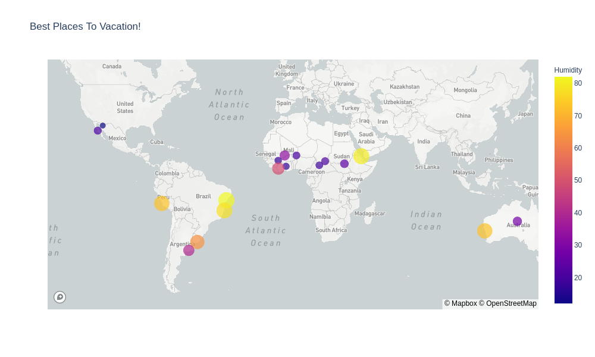

<h1><h1>python-api-challenge</h1></h1>

<h2>It's sunny and 5 o'clock somewhere!</h2>

Using OpenWeatherMap API, Google Maps API, MapBox, and plotly, I searched for an even distribution of cities across all latitudes and longitudes 
 From there I took the coordinates generated from OpenWeather and created a dataframe of the weather conditions requested (Max Temp, Humidity, WindSpeed, and Cloudiness) and plotted them against thie respective latitude.  I then compared those conditions as northern hemisphere vs southern hemisphere and plotted regressions to research any coorelations 
 Once that was complete, I refined the list to cities with optimal weather conditions and identified the closest hotel to city center using google maps and plotted the results on a heatmap that colored according to humidity. 
 There are many to choose from, but I think I'll stick close to home this year. 

Enjoy!  
-Ed
  
